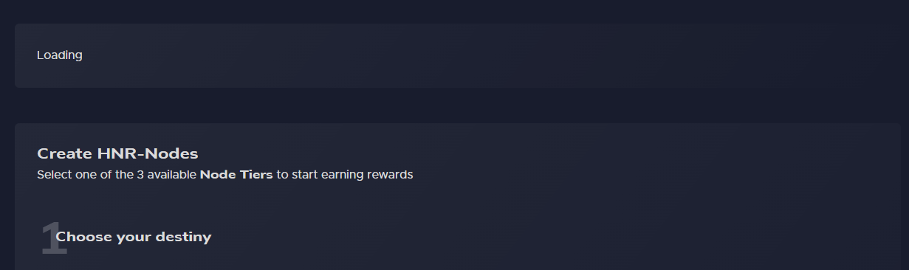
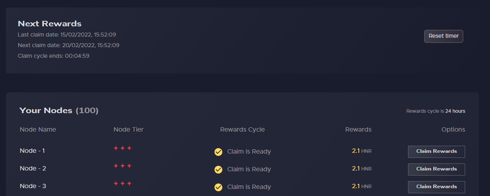
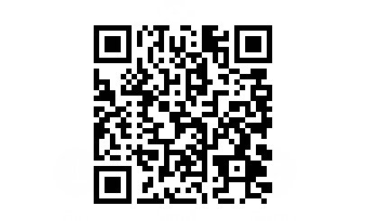

# Samurai Finacial improvements

> ⚠️ **Use at your own risk**

Community based Chrome extension for small tweaks to the Samurai Financial website

## Getting Started

1. Grab the latest release from the [Releases section](https://github.com/theothergothamdev/samurai-financial-chrome-ext/releases)
1. Follow the [Chrome Dev instructions](https://developer.chrome.com/docs/extensions/mv3/getstarted/#unpacked) for how to load an unpacked extension into Chrome
1. On first use click the "Set timer" button the next time you do a claim all to start the timer
1. Each time you claim all, be sure to reset the timer to begin tracking from the new claim date

## UI Fixes

- Remove horizontal overflow scrollbars from node cells

## UI Additions

### Loading banner

- Adds a loading message while node list is loading on page load

### Next rewards banner

- Adds a section to track 24 hour windows for rewards
- Data is stored in local storage to persist across reloads

## Maintainance

This was a quick project for myself and I have no intention of maintaining it in the future.

## Contributing

¯\\\_(ツ)\_/¯

## Donating

Feel like buying me a beer? 🍻

> 0xd2d4D33F7539bE8f0f03E748Cb8B1eEB307ce75

